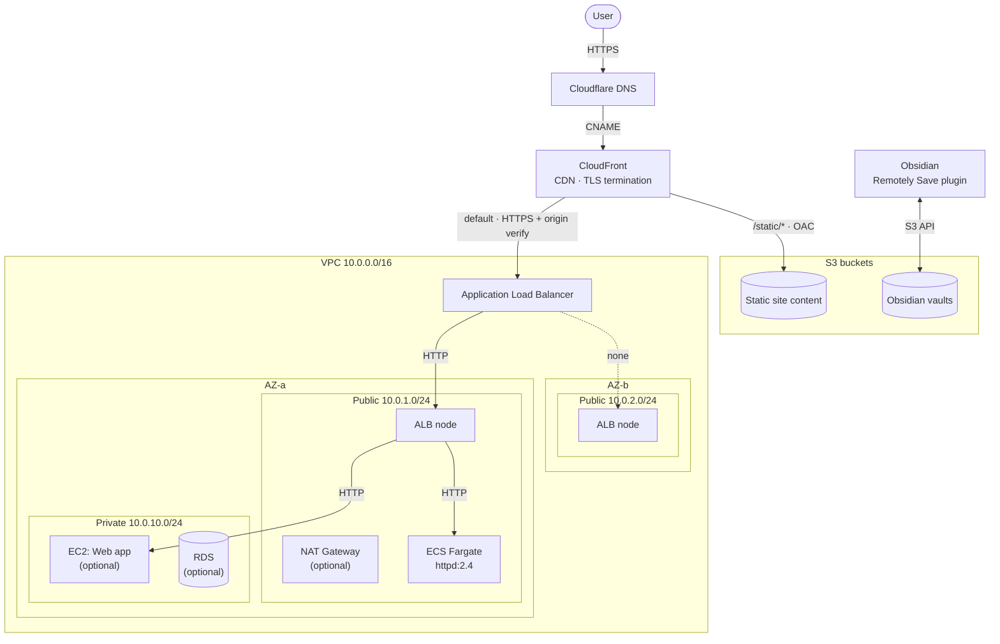

# AWS Demo Environment — Root Module

Ephemeral demo environment deployed on AWS. Auto-destroys after 24 hours via a Lambda function scheduled by EventBridge. Re-running `terraform apply` resets the 24h timer.

## Architecture



## Prerequisites

Bootstrap infrastructure must be applied first — see [bootstrap/README.md](bootstrap/README.md). Bootstrap creates:

- S3 bucket and DynamoDB table for this module's Terraform state
- Lambda function that auto-destroys this environment after 24h
- EventBridge schedule that triggers the Lambda hourly

## Modules

| Module | Source | Purpose |
| ------ | ------ | ------- |
| `networking` | `./modules/networking` | VPC, subnets, IGW, optional NAT Gateway, S3 VPC endpoint |
| `application_load_balancer` | `./modules/application-load-balancer` | ALB, target group, HTTPS listener, security groups |
| `ecs_fargate` | `./modules/ecs-fargate` | ECS cluster, Fargate service, task definition |
| `ssl_certificates` | `./modules/ssl-certificates` | ACM certificates (regional + us-east-1 for CloudFront) |
| `static_site` | `./modules/static-site` | S3 origin bucket, CloudFront distribution |
| `dns_cloudflare` | `./modules/dns-cloudflare` | Cloudflare DNS records, ACM DNS validation |
| `obsidian_vaults` | `./modules/obsidian-vaults` | S3 bucket + IAM user for Obsidian vault sync |

## Usage

```bash
export AWS_PROFILE=cargonautica
aws sso login

# 1. Complete bootstrap setup (once)
cd bootstrap && terraform apply && cd ..

# 2. Configure backend.tf with bootstrap outputs (once)
# See bootstrap/README.md Step 5

# 3. Deploy demo environment
terraform init
terraform plan
terraform apply

# 4. Get the site URL
terraform output cloudfront_domain_name

# 5. Environment auto-destroys after 24h, or destroy manually:
terraform destroy
```

## Inputs

| Name | Description | Type | Default | Required |
|------|-------------|------|---------|----------|
| `aws_region` | AWS region to deploy resources | `string` | `"eu-central-1"` | no |
| `environment` | Environment name | `string` | `"demo"` | no |
| `project_name` | Project name for resource naming and tagging | `string` | `"aws-demo"` | no |
| `vpc_cidr` | CIDR block for the VPC | `string` | `"10.0.0.0/16"` | no |
| `create_nat_gateway` | Create NAT Gateway for private subnet internet access (~$1/day) | `bool` | `false` | no |
| `domain_name` | Domain name for ACM certificate and CloudFront | `string` | `"turbobasic.dev"` | no |
| `cloudflare_api_token` | Cloudflare API token | `string` | — | **yes** |
| `cloudflare_zone_id` | Cloudflare zone ID | `string` | — | **yes** |
| `obsidian_bucket_name` | S3 bucket name suffix for Obsidian vaults | `string` | `"obsidian-sync"` | no |
| `obsidian_iam_user_name` | IAM user name for Obsidian vault access | `string` | `"obsidian-sync-user"` | no |

## Outputs

| Name | Description | Sensitive |
|------|-------------|-----------|
| `alb_dns_name` | DNS name of the Application Load Balancer | no |
| `vpc_id` | ID of the VPC | no |
| `ecs_cluster_name` | ECS cluster name | no |
| `ecs_service_name` | ECS service name | no |
| `cloudfront_distribution_id` | CloudFront distribution ID | no |
| `cloudfront_domain_name` | CloudFront distribution domain name | no |
| `s3_static_bucket_name` | S3 bucket name for static site content | no |
| `s3_static_bucket_arn` | S3 bucket ARN for static site content | no |
| `obsidian_vault_bucket_name` | S3 bucket name for Obsidian vaults | no |
| `obsidian_sync_access_key_id` | IAM access key ID for Obsidian sync | no |
| `obsidian_sync_secret_access_key` | IAM secret access key for Obsidian sync | **yes** |

Retrieve sensitive outputs with:

```bash
terraform output -raw obsidian_sync_secret_access_key
```

## Obsidian Vault Sync

The `obsidian_vaults` module creates a dedicated S3 bucket and IAM user for syncing Obsidian vaults using the [Remotely Save](https://github.com/remotely-save/remotely-save) plugin.

Unlike the rest of the demo environment, these resources are **not tagged for auto-destruction** — the vault data persists across `terraform destroy` / `terraform apply` cycles only if you manage state accordingly.

Configure the Remotely Save plugin with:

| Setting | Value |
|---------|-------|
| Remote service | S3 |
| Endpoint | `s3.eu-central-1.amazonaws.com` (or your region) |
| Region | `eu-central-1` |
| Bucket name | value of `obsidian_vault_bucket_name` output |
| Access key ID | value of `obsidian_sync_access_key_id` output |
| Secret access key | value of `obsidian_sync_secret_access_key` output |

## Cost Estimate

| Resource | Cost |
|----------|------|
| ALB | ~$0.70/day |
| ECS Fargate (0.25 vCPU, 0.5 GB) | ~$0.10/day |
| CloudFront | ~$0.01/day (minimal traffic) |
| NAT Gateway (if enabled) | ~$1.10/day |
| S3 (state + static site + Obsidian) | <$0.01/day |
| **Total (without NAT)** | **~$0.81/day** |

## File Structure

```
aws-demo-environment/
├── main.tf          # Provider config, module invocations
├── variables.tf     # Input variables
├── outputs.tf       # Output values
├── locals.tf        # name_prefix, common_tags, CIDR constants
├── data.tf          # AZs, AMI, caller identity, region
├── backend.tf       # S3 backend (configured from bootstrap outputs)
├── modules/
│   ├── networking/
│   ├── application-load-balancer/
│   ├── ecs-fargate/
│   ├── ssl-certificates/
│   ├── static-site/
│   ├── dns-cloudflare/
│   └── obsidian-vaults/
└── bootstrap/       # Persistent infra (state backend, Lambda destroyer)
```

## References

- [Bootstrap README](bootstrap/README.md) — first-time setup
- [Architecture plan](.claude/plans/04-00-aws-demo-environment-architecture.md)
